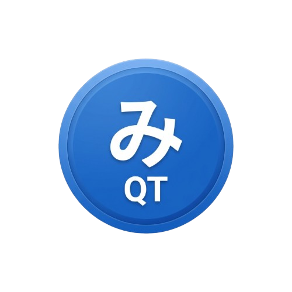

  

# MihonQT Documentation

Welcome to the official documentation for MihonQT, a cross-platform desktop manga reader.

## 📖 Available Documentation

- **[Frequently Asked Questions (FAQ)](FAQ.html)** - Common questions and troubleshooting tips.
- **[Security Audit](SECURITY_AUDIT.html)** - Detailed analysis of the project's security posture.
- **[Static Analysis](CPPCHECK.html)** - CppCheck configuration and usage.
- **[GitHub Repository](https://github.com/fam007e/mihonQT)** - Source code and issue tracking.

## 🚀 About the Project

MihonQT aims to bring the best features of the Mihon Android app to the desktop, providing a fast, extensible, and privacy-focused reading experience.

### Key Features
- **Material 3 Inspired UI:** A modern, beautiful interface consistent with Tachiyomi/Mihon Android.
- **Extension Trust System:** Enhanced security via the trust-based sandboxing system for third-party extensions.
- **Dynamic Theming:** Deep support for curated color palettes (Nord, Catppuccin, Tokyo Night, Dracula).
- **Multi-threaded Download Manager:** Fast and robust chapter downloads for offline reading.
- **Global Security Policies:** Enforce HTTPS and restrict untrusted extension network access.
- **Incognito Reading Mode:** Privacy-first reading with a single toggle.

## 🔒 Security & Privacy

The current state of MihonQT incorporates all major mitigations from the 2026 Security Audit, making it one of the most secure desktop manga readers available. Learn more in our **[Security Audit](SECURITY_AUDIT.md)**.
